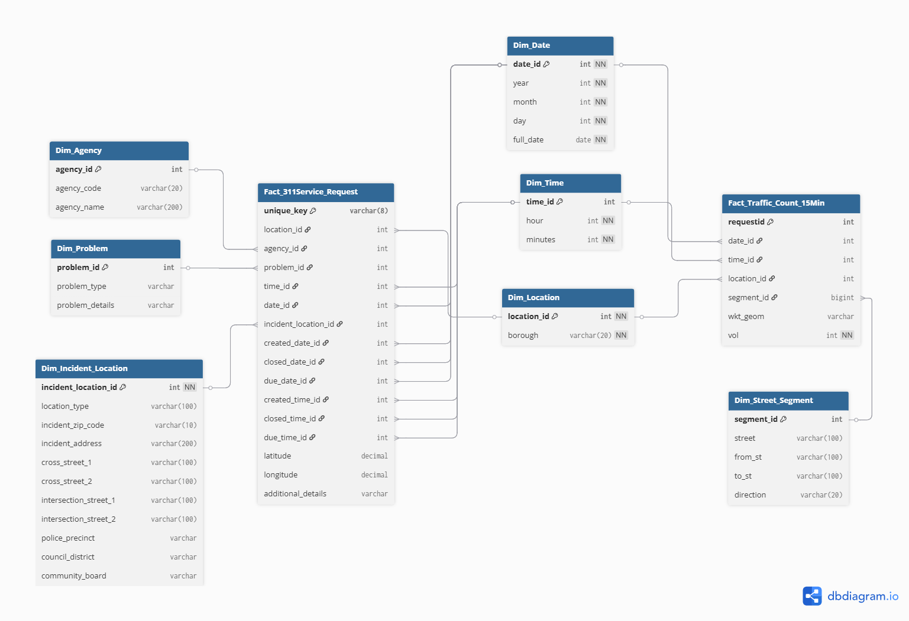

## Overview

The data warehouse follows the **Kimball method** designed as a star-schema dimensional model and
organized into two data marts, one per data source, sharing conformed dimensions
that enable cross-mart (enterprise) analysis.

| Mart | Fact Table | Grain |
|------|-----------|-------|
| **Mart 1: 311 Service Requests** | `Fact_311Service_Request` | One row per unique 311 service request |
| **Mart 2: Traffic Volume Counts** | `Fact_Traffic_Count_15Min` | One row per 15-minute volume count at a specific location and direction |

---

## Model Diagram

The diagram below was generated from the DBML source file using
[dbdiagram.io](https://dbdiagram.io). You can view and interact with the live
diagram at the link below.

> 🔗 **[View interactive diagram on dbdiagram.io](https://dbdiagram.io/d/CIS_9440UTA_group_3_milestone2_model_draft-699f4497bd82f5fce2d6e534)**  

{fig-alt="ERD diagram showing two star schemas connected via conformed dimensions"}

---

## Conformed Dimensions

Three dimensions are **shared** (conformed) across both marts, enabling cross-mart
joins for enterprise-level queries:

| Dimension | Key | Purpose |
|-----------|-----|---------|
| `Dim_Date` | `date_id` | Calendar date (year, month, day, full_date) |
| `Dim_Time` | `time_id` | Time-of-day (hour, minutes) |
| `Dim_Location` | `location_id` | Borough-level geographic grouping |

---

## Data Mart 1: 311 Service Requests

**Grain:** Each row is a unique 311 service request.

### Fact Table: `Fact_311Service_Request`

| Column | Type | Constraint | Notes |
|--------|------|-----------|-------|
| `unique_key` | varchar(8) | PK | Source unique identifier |
| `location_id` | int | FK → Dim_Location | Borough |
| `agency_id` | int | FK → Dim_Agency | Responding agency |
| `problem_id` | int | FK → Dim_Problem | Complaint type |
| `time_id` | int | FK → Dim_Time | Time of original creation |
| `date_id` | int | FK → Dim_Date | Date of original creation |
| `incident_location_id` | int | FK → Dim_Incident_Location | Full address detail |
| `created_date_id` | int | FK → Dim_Date | Request created date |
| `closed_date_id` | int | FK → Dim_Date | Request closed date (nullable) |
| `due_date_id` | int | FK → Dim_Date | Request due date (nullable) |
| `created_time_id` | int | FK → Dim_Time | |
| `closed_time_id` | int | FK → Dim_Time | nullable |
| `due_time_id` | int | FK → Dim_Time | nullable |
| `latitude` | decimal | nullable | Point location |
| `longitude` | decimal | nullable | Point location |
| `additional_details` | varchar | nullable | Status / resolution notes |

### Dimension Tables

::: {.callout-note collapse="true"}
#### `Dim_Problem`
Stores the complaint type and any sub-type details. Reduces cardinality vs. storing
free-text directly on the fact table.

| Column | Type | Constraint |
|--------|------|-----------|
| `problem_id` | int | PK |
| `problem_type` | varchar | e.g. "Street Condition", "Street Light Condition" |
| `problem_details` | varchar | nullable sub-type |
:::

::: {.callout-note collapse="true"}
#### `Dim_Agency`
| Column | Type |
|--------|------|
| `agency_id` | int PK |
| `agency_code` | varchar(20) e.g. "DOT" |
| `agency_name` | varchar(200) full name |
:::

::: {.callout-note collapse="true"}
#### `Dim_Incident_Location`
High-cardinality address data kept in a separate dimension to avoid bloating the fact
table. Includes zip code (used in choropleth map analysis), cross streets, precinct,
council district, and community board.

| Column | Type | Notes |
|--------|------|-------|
| `incident_location_id` | int PK | |
| `location_type` | varchar(100) | nullable |
| `incident_zip_code` | varchar(10) | used in zip-level analysis |
| `incident_address` | varchar(200) | high-cardinality; nullable |
| `cross_street_1/2` | varchar(100) | |
| `intersection_street_1/2` | varchar(100) | |
| `police_precinct` | varchar | |
| `council_district` | varchar | |
| `community_board` | varchar | |
:::

---

## Data Mart 2: Traffic Volume Counts

**Grain:** Each row is a volume count for a specific 15-minute interval at a specific
location and direction.

### Fact Table: `Fact_Traffic_Count_15Min`

| Column | Type | Constraint | Notes |
|--------|------|-----------|-------|
| `requestid` | int | PK | DOT sensor request ID |
| `date_id` | int | FK → Dim_Date | |
| `time_id` | int | FK → Dim_Time | 15-min bucket |
| `location_id` | int | FK → Dim_Location | Borough (conformed) |
| `segment_id` | bigint | FK → Dim_Street_Segment | Road segment |
| `wkt_geom` | varchar | nullable | WKT geometry string |
| `vol` | int | NOT NULL | Vehicle count for interval |

### Dimension Tables

::: {.callout-note collapse="true"}
#### `Dim_Street_Segment`
Captures the specific road segment where the sensor is located, including direction
of travel.

| Column | Type |
|--------|------|
| `segment_id` | int PK |
| `street` | varchar(100) |
| `from_st` | varchar(100) |
| `to_st` | varchar(100) |
| `direction` | varchar(20) e.g. "NB", "SB" |
:::

---

## Design Decisions & Notes

::: {.callout-tip}
**Why separate `Dim_Incident_Location` from `Dim_Location`?**  
`Dim_Location` is a conformed, low-cardinality borough-level dimension shared with
the traffic mart. `Dim_Incident_Location` holds high-cardinality address-level data
specific to 311 requests, preventing fact table bloat and preserving the conformed
dimension's reusability.
:::

::: {.callout-tip}
**Multiple date foreign keys on the fact table**  
Each 311 request has three relevant dates: created, closed, and due. Rather than
using a single date dimension, three foreign keys point to the same `Dim_Date` table,
a standard Kimball role-playing dimension pattern.
:::

::: {.callout-warning}
**Known challenge: geographic join between marts**  
The 311 data provides borough + zip code, while the traffic data provides a road
segment + WKT geometry. Cross-mart geographic joins are therefore at the
**borough level** rather than street-segment level. This is noted as a limitation in
the Conclusion section.
:::

---

## DBML Source

The full DBML source for this model is version-controlled in the project repository.

> 🔗 **[View DBML on GitHub](https://github.com/RaulSolaNavarro/nyc-analytics-project-rjsn/blob/main/models/group_3_project/CIS_9440UTA_group_3_milestone3_model_final.dbml)**
