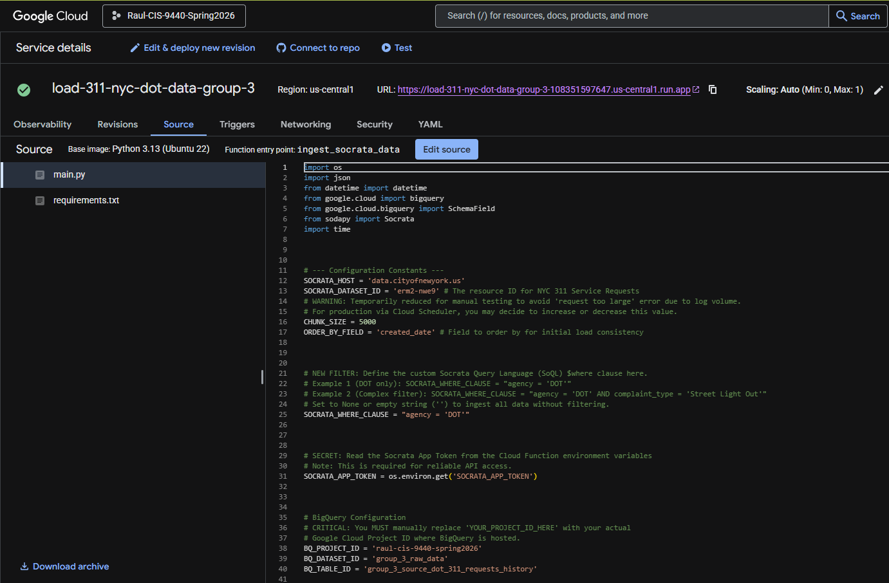
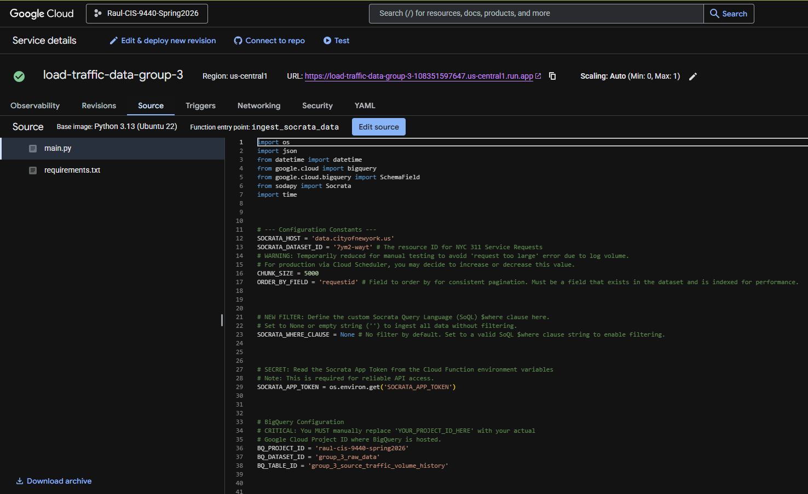
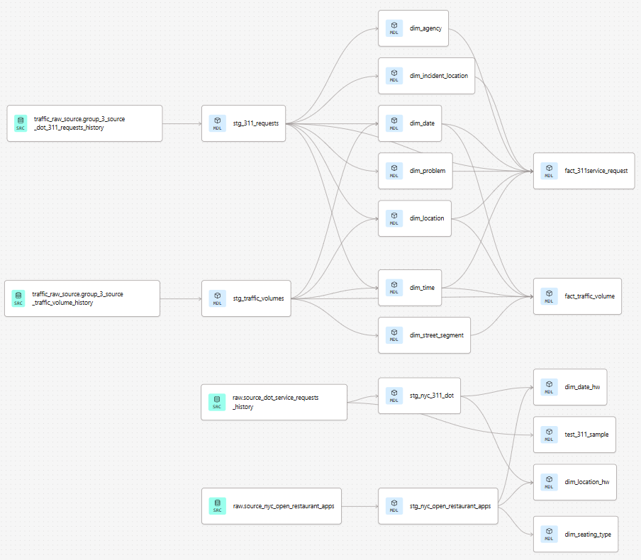
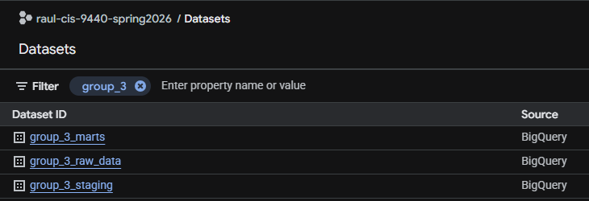

## Architecture Overview

The pipeline follows a standard modern data stack pattern:

```
NYC Open Data (Socrata API)
        │
        ▼
  Cloud Function (Python)          ← Extract & Load
        │
        ▼
  BigQuery - raw dataset           ← Raw tables (source-faithful)
        │
        ▼
  dbt - staging models             ← Type casting, renaming, light cleaning
        │
        ▼
  dbt - mart models                ← Star schema (facts + dimensions)
        │
        ▼
  BigQuery - group_3_marts         ← Final warehouse
        │
        ▼
  Data Studio (Looker Studio)      ← Visualization & dashboards
```

---

## Tools Used

| Tool | Purpose |
|------|---------|
| **Socrata Open Data API** | Extracted both source datasets from NYC Open Data |
| **Google Cloud Functions (Python)** | Server-less extract-and-load scripts that wrote raw data to BigQuery |
| **Google BigQuery** | Cloud data warehouse → hosts raw, staging, and mart datasets |
| **dbt (data build tool)** | SQL-based transformation framework; manages staging → mart models with lineage tracking |
| **GitHub** | Version control for all dbt models, macros, and project config |
| **Data Studio (Looker Studio)** | BI dashboarding and visualization layer |

---

## Extract & Load

### Cloud Functions

Both data sources were extracted from the NYC Open Data Socrata API using
Google Cloud Functions written in Python. Each function authenticated with the API,
paginated through results filtered to the 2020-2025 date range, and loaded the
raw JSON responses directly into BigQuery.

#### 311 Service Requests

{fig-alt="Screenshot of Cloud Function - 311 Service Requests"}

#### Traffic Volume Counts

{fig-alt="Screenshot of Cloud Function - Traffic Volume Counts"}

### Raw Tables in BigQuery

After extraction, two raw tables existed in BigQuery:

| Dataset | Table | Description |
|---------|-------|-------------|
| `group_3_raw` | `raw_311_service_requests` | All NYC 311 service requests filtered to street-related complaint types, 2020-2025 |
| `group_3_raw` | `raw_traffic_volume_counts` | DOT automated traffic count records at 15-minute intervals, 2020-2025 |

::: {layout-ncol=2}
{fig-alt="BQ screenshot → 311 raw table"}

{fig-alt="BQ screenshot → traffic raw table"}
:::

---

## Transform → dbt Models

All transformations were written in dbt SQL and are version-controlled in the
project GitHub repository.

> 🔗 **[View dbt models on GitHub](https://github.com/RaulSolaNavarro/nyc-analytics-project-rjsn/tree/main/models)**

### DAG Lineage

The dbt DAG lineage graph below shows the full dependency chain from raw sources
through staging to the final mart tables.

{fig-alt="dbt DAG lineage graph"}
{fig-alt="dbt DAG lineage graph"}

### Staging Layer

Staging models perform light transformation on the raw tables: renaming columns to
consistent snake_case, casting types, and filtering out clearly invalid records
(e.g., closed dates earlier than created dates).

Key staging transformations for `stg_311_service_requests`:

- Parsed `created_date`, `closed_date`, `due_date` as `DATE` types (source is string)
- Extracted `year`, `month`, `day` to support date dimension surrogate key generation
- Filtered complaint types to the five street-related categories
- Standardized borough names to title case

Key staging transformations for `stg_traffic_volume_counts`:

- Parsed `date` column as `DATE`
- Extracted `hour` and `minute` from the timestamp string
- Mapped `segmentid` to the street segment dimension
- Filtered to records within 2020–2025

### Mart Layer

The mart layer implements the full star-schema dimensional model. dbt models
create each dimension table first (using `{{ generate_surrogate_key() }}`
for surrogate keys), then the fact tables that reference them.

| dbt Model | Target Table | Type |
|-----------|-------------|------|
| `dim_date` | `group_3_marts.dim_date` | Dimension |
| `dim_time` | `group_3_marts.dim_time` | Dimension |
| `dim_location` | `group_3_marts.dim_location` | Dimension (conformed) |
| `dim_problem` | `group_3_marts.dim_problem` | Dimension |
| `dim_agency` | `group_3_marts.dim_agency` | Dimension |
| `dim_incident_location` | `group_3_marts.dim_incident_location` | Dimension |
| `dim_street_segment` | `group_3_marts.dim_street_segment` | Dimension |
| `fact_311service_request` | `group_3_marts.fact_311service_request` | Fact |
| `fact_traffic_volume` | `group_3_marts.fact_traffic_volume` | Fact |

### BigQuery Datasets → Final State

{fig-alt="BigQuery datasets screenshot"}

---

## dbt Project Config

The `dbt_project.yml` and `packages.yml` are in the repository root. The project
uses the `generate_schema_name` macro to keep dataset names consistent across
environments.

> 🔗 **[dbt_project.yml on GitHub](https://github.com/RaulSolaNavarro/nyc-analytics-project-rjsn/blob/main/dbt_project.yml)**

---

## Reproducibility

To reproduce the full pipeline from scratch:

1. Clone the GitHub repository
2. Set up a BigQuery project and configure `profiles.yml` with your credentials
3. Run the Cloud Function (or equivalent) to load raw data
4. From the repo root: `dbt deps && dbt run && dbt test`
5. Run the Milestone 5 SQL queries (`queries/milestone5_queries.sql`) in BigQuery
   to create the analytics mart tables used by Looker Studio
