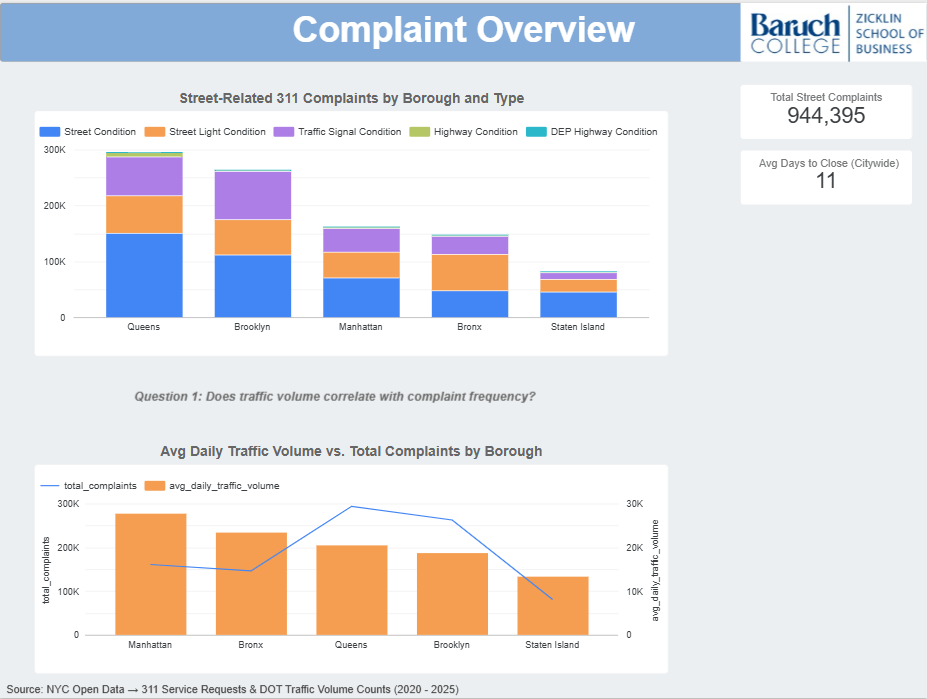
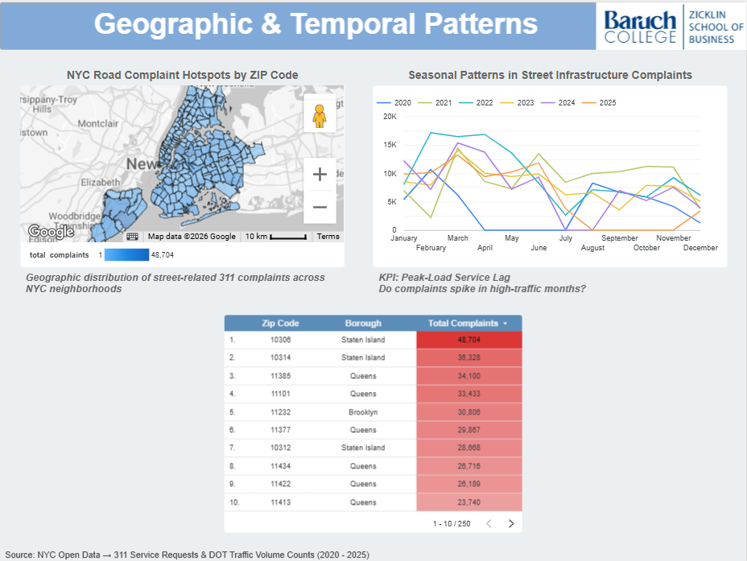

## Dashboard

The interactive Looker Studio dashboard below brings together all nine analytics
queries into a unified view across three pages: Complaint Overview, Response Time
Analysis, and Geographic & Temporal Patterns.

> 🔗 **[Open dashboard in Data Studio](https://datastudio.google.com/reporting/b7835c43-9acb-4aa1-9cd6-e9230b5421d8)**  

---

## Dashboard Pages

### Page 1: Complaint Overview

Addresses **Question 1**: Does traffic volume correlate with complaint frequency?

::: {layout-ncol=1}
{fig-alt="Dashboard page 1: Complaint Overview"}
:::

**Key findings:**

- Queens leads in total complaints (293,845), followed by Brooklyn (265,040)
- Manhattan has the highest average daily traffic volume (~28K) but ranks 3rd in
  total complaints, suggesting traffic volume alone does not linearly predict
  complaint frequency
- Street Condition and Street Light Condition account for the majority of complaints
  across all boroughs

### Page 2: Response Time Analysis

Addresses **Question 2** and the **T2R KPI**: Does response time vary across boroughs,
and does higher traffic lead to longer repair times?

::: {layout-ncol=1}
{fig-alt="Dashboard page 2: Response Time Analysis"}
:::

**Key findings:**

- Brooklyn has the slowest avg response time (14 days); Staten Island the fastest (7 days)
- Queens has the most complaints (293,845) but ranks 3rd in response time (12 days),
  suggesting the DOT handles high complaint volumes there relatively efficiently
- **Peak-Load Service Lag KPI:** Avg days to close during peak traffic months is
  **11.99 days** vs. **12.90 days** during non-peak months, response times are
  *slightly faster* during high-traffic periods, suggesting no significant maintenance
  lag driven by traffic volume alone
- The T2R dual-axis chart shows no consistent pattern between traffic volume and repair
  time across boroughs. Manhattan has the highest traffic but mid-range response time,
  while Brooklyn has mid-range traffic but the slowest repairs

### Page 3: Geographic & Temporal Patterns

Addresses the **Peak-Load Service Lag KPI**: Do complaints spike in high-traffic months?

::: {layout-ncol=1}
{fig-alt="Dashboard page 3: Geographic & Temporal Patterns"}
:::

**Key findings:**

- ZIP code 10306 (Staten Island) has the highest total complaint count (48,704),
  followed by 10314 (Staten Island, 36,328) and 11385 (Queens, 34,100)
- Seasonal patterns show complaint peaks in spring/early summer months across most years
- 2022 and 2023 show notably higher complaint volumes than 2020–2021 (partial pandemic effect)

---

## SQL Queries

All queries were run in BigQuery against the `raul-cis-9440-spring2026.group_3_marts`
dataset. Each `CREATE TABLE` version persists results as a mart table used directly
by Data Studio.

> 🔗 **[Full SQL file on GitHub](https://github.com/RaulSolaNavarro/nyc-analytics-project-rjsn)**
> or see `queries/milestone5_queries.sql` in this repository.

---

### Query 1: Complaints by Borough and Problem Type

**Aggregation:** borough × problem type  
**Purpose:** Baseline complaint counts per borough → the foundation for cross-mart
comparison with traffic volume.

```sql
SELECT
    l.borough                                           AS borough,
    p.problem_type                                      AS problem_type,
    COUNT(*)                                            AS total_complaints
FROM `raul-cis-9440-spring2026.group_3_marts.fact_311service_request` f
INNER JOIN `raul-cis-9440-spring2026.group_3_marts.dim_location` l
    ON f.location_id = l.location_key
INNER JOIN `raul-cis-9440-spring2026.group_3_marts.dim_problem` p
    ON f.problem_id = p.problem_key
WHERE p.problem_type IN (
    'Street Condition',
    'Street Light Condition',
    'Traffic Signal Condition',
    'Highway Condition',
    'DEP Highway Condition'
)
GROUP BY l.borough, p.problem_type
ORDER BY total_complaints DESC;
```

---

### Query 2: Avg Response Time (Days to Close) by Borough

**Aggregation:** borough  
**Purpose:** Answers Q2: Does borough response time vary? Uses two CTE date joins
to compute `DATE_DIFF` between `created_date` and `closed_date`.

```sql
WITH created_dates AS (
    SELECT
        f.unique_key,
        f.location_id,
        f.problem_id,
        d.full_date                                     AS created_date
    FROM `raul-cis-9440-spring2026.group_3_marts.fact_311service_request` f
    INNER JOIN `raul-cis-9440-spring2026.group_3_marts.dim_date` d
        ON f.created_date_id = d.date_key
),
closed_dates AS (
    SELECT
        f.unique_key,
        d.full_date                                     AS closed_date
    FROM `raul-cis-9440-spring2026.group_3_marts.fact_311service_request` f
    INNER JOIN `raul-cis-9440-spring2026.group_3_marts.dim_date` d
        ON f.closed_date_id = d.date_key
)
SELECT
    l.borough,
    COUNT(*)                                            AS total_closed_requests,
    ROUND(AVG(DATE_DIFF(cl.closed_date,
              cr.created_date, DAY)), 2)                AS avg_days_to_close,
    MIN(DATE_DIFF(cl.closed_date,
        cr.created_date, DAY))                          AS min_days_to_close,
    MAX(DATE_DIFF(cl.closed_date,
        cr.created_date, DAY))                          AS max_days_to_close
FROM created_dates cr
INNER JOIN closed_dates cl      ON cr.unique_key = cl.unique_key
INNER JOIN `raul-cis-9440-spring2026.group_3_marts.dim_location` l
    ON cr.location_id = l.location_key
INNER JOIN `raul-cis-9440-spring2026.group_3_marts.dim_problem` p
    ON cr.problem_id = p.problem_key
WHERE p.problem_type IN (
    'Street Condition', 'Street Light Condition',
    'Traffic Signal Condition', 'Highway Condition', 'DEP Highway Condition'
)
  AND cl.closed_date >= cr.created_date   -- exclude data anomalies
GROUP BY l.borough
ORDER BY avg_days_to_close DESC;
```

---

### Query 3: Monthly Complaint Trends by Year

**Aggregation:** year × month  
**Purpose:** Identifies seasonal patterns in street infrastructure complaints.
Used in cross-mart comparison with monthly traffic volume (Query 5).

```sql
SELECT
    d.year                                              AS complaint_year,
    d.month                                             AS complaint_month,
    COUNT(*)                                            AS total_complaints
FROM `raul-cis-9440-spring2026.group_3_marts.fact_311service_request` f
INNER JOIN `raul-cis-9440-spring2026.group_3_marts.dim_date` d
    ON f.created_date_id = d.date_key
INNER JOIN `raul-cis-9440-spring2026.group_3_marts.dim_problem` p
    ON f.problem_id = p.problem_key
WHERE p.problem_type IN (
    'Street Condition', 'Street Light Condition',
    'Traffic Signal Condition', 'Highway Condition', 'DEP Highway Condition'
)
  AND d.year BETWEEN 2020 AND 2025
GROUP BY d.year, d.month
ORDER BY d.year, d.month;
```

---

### Query 4: Avg Daily Traffic Volume by Borough

**Aggregation:** borough  
**Purpose:** Computes borough-level average daily traffic volume from the 15-minute
interval counts. Used as the traffic side of the cross-mart comparison.

```sql
SELECT
    l.borough                                           AS borough,
    ROUND(AVG(daily.daily_vol), 0)                      AS avg_daily_traffic_volume
FROM (
    SELECT
        f.location_id,
        d.full_date,
        SUM(f.vol)                                      AS daily_vol
    FROM `raul-cis-9440-spring2026.group_3_marts.fact_traffic_volume` f
    INNER JOIN `raul-cis-9440-spring2026.group_3_marts.dim_date` d
        ON f.date_id = d.date_key
    GROUP BY f.location_id, d.full_date
) daily
INNER JOIN `raul-cis-9440-spring2026.group_3_marts.dim_location` l
    ON daily.location_id = l.location_key
GROUP BY l.borough
ORDER BY avg_daily_traffic_volume DESC;
```

---

### Query 5: Monthly Traffic vs. Complaints (Cross-Mart) ⭐

**Aggregation:** borough × year × month  
**Cross-mart:** Joins `fact_traffic_volume` + `fact_311service_request` via conformed
`Dim_Date` and `Dim_Location`.  
**Purpose:** Core cross-mart query → computes a `complaints_per_million_vehicles`
ratio to normalize complaint frequency against traffic load.

```sql
WITH monthly_traffic AS (
    SELECT
        l.borough,
        d.year,
        d.month,
        SUM(f.vol)                                      AS monthly_traffic_volume
    FROM `raul-cis-9440-spring2026.group_3_marts.fact_traffic_volume` f
    INNER JOIN `raul-cis-9440-spring2026.group_3_marts.dim_date` d
        ON f.date_id = d.date_key
    INNER JOIN `raul-cis-9440-spring2026.group_3_marts.dim_location` l
        ON f.location_id = l.location_key
    WHERE d.year BETWEEN 2020 AND 2025
    GROUP BY l.borough, d.year, d.month
),
monthly_complaints AS (
    SELECT
        l.borough,
        d.year,
        d.month,
        COUNT(*)                                        AS monthly_complaints
    FROM `raul-cis-9440-spring2026.group_3_marts.fact_311service_request` f
    INNER JOIN `raul-cis-9440-spring2026.group_3_marts.dim_date` d
        ON f.created_date_id = d.date_key
    INNER JOIN `raul-cis-9440-spring2026.group_3_marts.dim_location` l
        ON f.location_id = l.location_key
    INNER JOIN `raul-cis-9440-spring2026.group_3_marts.dim_problem` p
        ON f.problem_id = p.problem_key
    WHERE p.problem_type IN (
        'Street Condition', 'Street Light Condition',
        'Traffic Signal Condition', 'Highway Condition', 'DEP Highway Condition'
    )
      AND d.year BETWEEN 2020 AND 2025
    GROUP BY l.borough, d.year, d.month
)
SELECT
    mt.borough,
    mt.year,
    mt.month,
    mt.monthly_traffic_volume,
    mc.monthly_complaints                               AS monthly_street_complaints,
    ROUND(mc.monthly_complaints /
          NULLIF(mt.monthly_traffic_volume, 0) * 1000000, 4)
                                                        AS complaints_per_million_vehicles
FROM monthly_traffic mt
INNER JOIN monthly_complaints mc
    ON mt.borough = mc.borough
   AND mt.year    = mc.year
   AND mt.month   = mc.month
ORDER BY mt.borough, mt.year, mt.month;
```

---

### Query 6: Complaints by ZIP Code (Choropleth Map)

**Aggregation:** zip code × borough × problem type  
**Purpose:** Provides ZIP-code-level complaint counts for the choropleth map in
Looker Studio, enabling granular geographic analysis beyond borough level.

```sql
CREATE OR REPLACE TABLE
  `raul-cis-9440-spring2026.group_3_marts.complaints_by_zip_code`
AS
SELECT
    il.zip_code,
    l.borough,
    p.problem_type,
    COUNT(*)                                            AS total_complaints
FROM `raul-cis-9440-spring2026.group_3_marts.fact_311service_request` f
INNER JOIN `raul-cis-9440-spring2026.group_3_marts.dim_incident_location` il
    ON f.incident_location_id = il.incident_location_key
INNER JOIN `raul-cis-9440-spring2026.group_3_marts.dim_location` l
    ON f.location_id = l.location_key
INNER JOIN `raul-cis-9440-spring2026.group_3_marts.dim_problem` p
    ON f.problem_id = p.problem_key
WHERE p.problem_type IN (
    'Street Condition', 'Street Light Condition',
    'Traffic Signal Condition', 'Highway Condition', 'DEP Highway Condition'
)
  AND il.zip_code IS NOT NULL
  AND il.zip_code != '10000'   -- exclude invalid zip code
GROUP BY il.zip_code, l.borough, p.problem_type
ORDER BY total_complaints DESC;
```

---

### Query 7: Combined Traffic vs. Complaints by Borough (Cross-Mart) ⭐

**Aggregation:** borough  
**Cross-mart:** Combines `fact_traffic_volume` + `fact_311service_request`.  
**Purpose:** Single borough-level table for the dual-axis dashboard chart that
directly addresses Q1.

```sql
WITH traffic AS (
    SELECT
        l.borough,
        ROUND(AVG(daily.daily_vol), 0)                  AS avg_daily_traffic_volume
    FROM (
        SELECT f.location_id, d.full_date, SUM(f.vol)   AS daily_vol
        FROM `raul-cis-9440-spring2026.group_3_marts.fact_traffic_volume` f
        INNER JOIN `raul-cis-9440-spring2026.group_3_marts.dim_date` d
            ON f.date_id = d.date_key
        GROUP BY f.location_id, d.full_date
    ) daily
    INNER JOIN `raul-cis-9440-spring2026.group_3_marts.dim_location` l
        ON daily.location_id = l.location_key
    GROUP BY l.borough
),
complaints AS (
    SELECT
        l.borough,
        COUNT(*)                                        AS total_complaints
    FROM `raul-cis-9440-spring2026.group_3_marts.fact_311service_request` f
    INNER JOIN `raul-cis-9440-spring2026.group_3_marts.dim_location` l
        ON f.location_id = l.location_key
    INNER JOIN `raul-cis-9440-spring2026.group_3_marts.dim_problem` p
        ON f.problem_id = p.problem_key
    WHERE p.problem_type IN (
        'Street Condition', 'Street Light Condition',
        'Traffic Signal Condition', 'Highway Condition', 'DEP Highway Condition'
    )
    GROUP BY l.borough
)
SELECT
    t.borough,
    t.avg_daily_traffic_volume,
    c.total_complaints
FROM traffic t
INNER JOIN complaints c ON t.borough = c.borough
ORDER BY t.avg_daily_traffic_volume DESC;
```

---

### Query 8: Traffic-to-Repair Correlation (T2R) by Borough ⭐

**Aggregation:** borough  
**Cross-mart:** Joins `complaints_vs_traffic_by_borough` + `response_time_by_borough`  
**Purpose:** Directly addresses the **T2R KPI**: Does higher traffic volume correlate
with slower repair times? Computes two derived metrics: `traffic_per_repair_day`
(traffic absorbed per repair day) and `complaints_per_repair_day` (repair throughput).
Powers the dual-axis T2R chart on the Response Time Analysis dashboard page.

```sql
CREATE TABLE IF NOT EXISTS
  `raul-cis-9440-spring2026.group_3_marts.traffic_to_repair_correlation`
AS
SELECT
    t.borough,
    t.avg_daily_traffic_volume,
    t.total_complaints,
    r.avg_days_to_close,
    r.total_closed_requests,
    -- T2R metric: does higher traffic correlate with longer repair time?
    ROUND(t.avg_daily_traffic_volume /
          NULLIF(r.avg_days_to_close, 0), 2)            AS traffic_per_repair_day,
    -- Complaint resolution rate: complaints per day to close
    ROUND(t.total_complaints /
          NULLIF(r.avg_days_to_close, 0), 2)            AS complaints_per_repair_day
FROM `raul-cis-9440-spring2026.group_3_marts.complaints_vs_traffic_by_borough` t
INNER JOIN `raul-cis-9440-spring2026.group_3_marts.response_time_by_borough` r
    ON t.borough = r.borough
ORDER BY avg_daily_traffic_volume DESC;
```

---

### Query 9: Peak-Load Service Lag KPI ⭐

**Aggregation:** traffic period (Peak vs. Non-Peak months)  
**Cross-mart:** Joins `fact_traffic_volume` + `fact_311service_request` + `dim_date` + `dim_problem`  
**Purpose:** Directly addresses the **Peak-Load Service Lag KPI**: Does avg time to
close 311 complaints increase during months with above-average traffic volume? Peak
months are defined as months where total traffic volume exceeds the overall monthly
average across 2020–2025.

**Finding:** Response times are slightly *faster* during peak traffic months
(11.99 days) vs. non-peak (12.90 days), suggesting no significant maintenance lag
during high-traffic periods.

```sql
CREATE TABLE IF NOT EXISTS
  `raul-cis-9440-spring2026.group_3_marts.peak_load_service_lag`
AS
WITH monthly_avg_traffic AS (
    SELECT
        d.year, d.month,
        SUM(f.vol)                                      AS monthly_traffic_volume
    FROM `raul-cis-9440-spring2026.group_3_marts.fact_traffic_volume` f
    INNER JOIN `raul-cis-9440-spring2026.group_3_marts.dim_date` d
        ON f.date_id = d.date_key
    WHERE d.year BETWEEN 2020 AND 2025
    GROUP BY d.year, d.month
),
annual_avg_traffic AS (
    SELECT AVG(monthly_traffic_volume)                  AS avg_monthly_traffic
    FROM monthly_avg_traffic
),
peak_months AS (
    SELECT
        mt.year, mt.month, mt.monthly_traffic_volume,
        CASE
            WHEN mt.monthly_traffic_volume > aat.avg_monthly_traffic
            THEN 'Peak'
            ELSE 'Non-Peak'
        END                                             AS traffic_period
    FROM monthly_avg_traffic mt
    CROSS JOIN annual_avg_traffic aat
),
response_times AS (
    SELECT
        cd.year, cd.month,
        DATE_DIFF(cl.full_date, cd.full_date, DAY)      AS days_to_close
    FROM `raul-cis-9440-spring2026.group_3_marts.fact_311service_request` f
    INNER JOIN `raul-cis-9440-spring2026.group_3_marts.dim_date` cd
        ON f.created_date_id = cd.date_key
    INNER JOIN `raul-cis-9440-spring2026.group_3_marts.dim_date` cl
        ON f.closed_date_id = cl.date_key
    INNER JOIN `raul-cis-9440-spring2026.group_3_marts.dim_problem` p
        ON f.problem_id = p.problem_key
    WHERE p.problem_type IN (
        'Street Condition', 'Street Light Condition',
        'Traffic Signal Condition', 'Highway Condition', 'DEP Highway Condition'
    )
    AND cl.full_date >= cd.full_date
    AND cd.year BETWEEN 2020 AND 2025
)
SELECT
    pm.traffic_period,
    COUNT(*)                                            AS total_requests,
    ROUND(AVG(CAST(rt.days_to_close AS FLOAT64)), 2)   AS avg_days_to_close,
    MIN(rt.days_to_close)                               AS min_days_to_close,
    MAX(rt.days_to_close)                               AS max_days_to_close
FROM response_times rt
INNER JOIN peak_months pm
    ON rt.year = pm.year AND rt.month = pm.month
GROUP BY pm.traffic_period
ORDER BY pm.traffic_period;
```

---

## Aggregation Summary

Per the milestone requirements, the queries above include at least two distinct
aggregation types:

| Query | Aggregation type |
|-------|-----------------|
| Q1 | By borough + complaint type |
| Q2 | By borough (response time) |
| Q3 | By year + month (temporal) |
| Q4 | By borough (traffic volume) |
| Q5 | By borough + year + month (cross-mart) |
| Q6 | By ZIP code + borough + type (geographic) |
| Q7 | By borough (cross-mart combined) |
| Q8 | By borough (T2R derived metrics, cross-mart) |
| Q9 | By traffic period → Peak vs. Non-Peak (cross-mart) |
